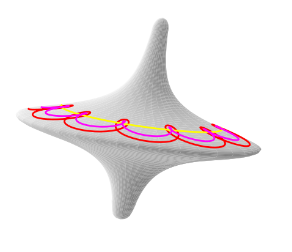

Examples
========

All the figures created with the 3D annotating toolbox.

get_tilt_angle_full.py
-----------------------

.. image:: ../../figure_2_af_resized_powered.PNG
   :scale: 80 %
   :align: center

File to create this graph: should be in the get_tilt_angle_full*.py files. Need to isolate the drawing part.

tetra_premise_1.py
------------------

.. image:: ./figures/Fig_1.png
   :scale: 60 %
   :align: center

lemma4_fig4.py
--------------

.. tikz::[>=latex',dotted,thick] \draw[->] (0,0) -- (1,1) -- (1,0)
   -- (2,0);
   :libs: arrows

.. tikz:: Ceva's theorem
   :include: ./figures/lemma4_fig4.pgf

gyrologodraw10.py
-----------------

Case_C_omega_noise_fig.tex
--------------------------
In ./otherstuff/data_text_files/
