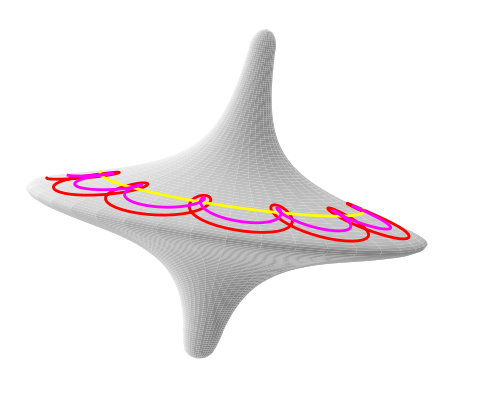

Examples
========

All the figures created with the 3D annotating toolbox.

get_tilt_angle_full.py
-----------------------

.. image:: ../../../figure_2_af_resized_powered.PNG
   :scale: 80 %
   :align: center

File to create this graph should be in the get_tilt_angle_full.py files. Need to isolate the drawing part.

tetra_premise_1.py
------------------

lemma4_fig4.py
--------------

.. tikz:: Ceva's theorem
   :include: ./figures/lemma4_fig4.pgf

gyrologodraw10.py
-----------------

Case_C_omega_noise_fig.tex
--------------------------

In ./otherstuff/data_text_files/

TeX group logo
--------------

In ./drawing_code/latex/logos_creation/tex_group_logo.tex

.. image:: ./figures/tex_group_logo.pdf
   :scale: 60 %
   :align: center

tetrahedron midsphere
---------------------

.. tikz::
   :include: ./figures/midsphere.pgf

tetrahedron circumscribed sphere
--------------------------------

.. tikz::
   :include: ./figures/outsphere.pgf
